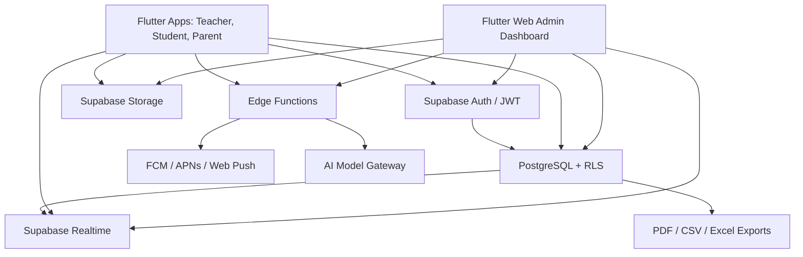

# System Architecture

## High-Level Architecture



## Backend

- Supabase Auth authenticates users and issues JWTs.
- PostgreSQL stores all domain data in normalized relational tables.
- RLS enforces row-level access for each role and organization.
- Realtime can subscribe to student records, notifications, and dashboards.
- Edge Functions handle privileged operations:
  - `notify-event`: sends queued notifications to device tokens.
  - `ai-insights`: analyzes student performance and persists recommendations.

## Flutter Architecture

The Flutter app follows clean architecture in feature modules:

```text
lib/
  core/
    config/
    di/
    error/
    l10n/
    routing/
    theme/
  features/
    auth/
      data/
      domain/
      presentation/
    students/
    memorization/
    attendance/
    reports/
    dashboard/
```

## State Management

- Riverpod providers hold repositories, auth state, theme, locale, and feature queries.
- Repositories isolate Supabase calls from UI widgets.
- Domain models parse database rows and keep UI independent from SQL structure.

## Scalability Patterns

- Multi-tenant rows include `organization_id`.
- All high-traffic tables index `organization_id`, `student_id`, `circle_id`, and descending date columns.
- Append-heavy records are separated from profile tables.
- Reporting reads summary views and can later move to materialized views.
- Large exports should run through background jobs or Edge Functions, not client loops.

## Recommended Production Additions

- Materialized dashboard aggregates refreshed every 5-15 minutes.
- Read replicas for analytics-heavy dashboards.
- Partitioning for `audit_logs`, `daily_memorization_records`, and `attendance_records` once volume passes tens of millions of rows.
- Object storage buckets for avatars, certificates, and generated PDF archives.
- Observability stack: Supabase logs, Postgres slow query monitoring, Sentry for Flutter.
