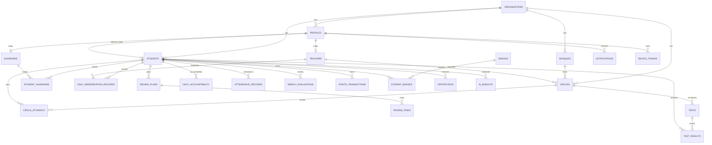

# Database Schema and ERD

## Main Tables

- `organizations`: tenant root.
- `profiles`: user identity, role, organization, and active status.
- `teachers`, `guardians`, `students`: role-specific data.
- `mosques`, `circles`, `circle_students`: circle management and enrollment.
- `student_guardians`: parent-child access links.
- `daily_memorization_records`: daily memorization, review, and test entries.
- `review_plans`, `review_tasks`: smart review schedule.
- `daily_accountability`: prayers, adhkar, behavior, reading, good deeds.
- `attendance_records`: daily attendance and absence status.
- `tests`, `test_results`: formal assessments.
- `weekly_evaluations`: weekly scores and rankings.
- `points_transactions`, `badges`, `student_badges`, `certificates`: gamification.
- `notifications`, `device_tokens`: notification queue and delivery targets.
- `ai_insights`: AI analysis output.
- `audit_logs`: operational audit trail.
- `quran_surahs`: Quran reference lookup.

## ERD

## Important Constraints

- One active circle per student is enforced with a partial unique index.
- One primary guardian per student is enforced with a partial unique index.
- Scores are constrained to valid ranges.
- Quran surah numbers are constrained to 1-114.
- Weekly totals, averages, percentages, and mastery percentages are generated columns.

## Important Indexes

- `profiles(organization_id, role)` for RBAC lookup.
- `students(organization_id, status)` for admin dashboards.
- `daily_memorization_records(student_id, record_date desc)` for student timelines.
- `attendance_records(circle_id, attendance_date desc)` for daily teacher workflows.
- `weekly_evaluations(circle_id, week_start desc, total_score desc)` for rankings.
- `notifications(recipient_profile_id, status, created_at desc)` for in-app inboxes.

## Backup Strategy

- Enable Supabase daily backups and point-in-time recovery for production.
- Export schema migrations to version control.
- Store generated certificates and reports in a versioned storage bucket.
- Test restore quarterly using a staging project.
- Retain audit logs for the institution's compliance period, then archive to cold storage.
